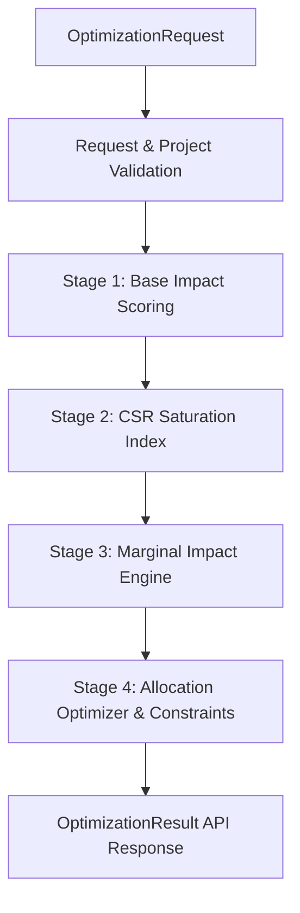

# AllocateAI Decision Engine — Backend Architecture

**Authoritative Documents:** Software Contract v1.0 & Technical Contract v1.0  
**Ownership Area:** Member C (Decision Engine)  
**Status:** Production Ready (Phase 6 Final)  

---

## 1. Architectural Overview

AllocateAI's backend decision pipeline replaces probabilistic guesses with a verifiable, mathematically bounded, deterministic multi-stage decision pipeline.

The architecture is strictly decoupled into three tiers:

```text
┌─────────────────────────────────────────────────────────────────────────┐
│                           API Routing Tier                              │
│  FastAPI Router (/api/v1/optimize, /api/v1/simulate, /health, /version)  │
└────────────────────────────────────┬────────────────────────────────────┘
                                     │
                                     ▼
┌─────────────────────────────────────────────────────────────────────────┐
│                     Service Orchestration Tier                          │
│        OptimizationService (Validates, Prepares Context, Orchestrates)  │
└────────────────────────────────────┬────────────────────────────────────┘
                                     │
                                     ▼
┌─────────────────────────────────────────────────────────────────────────┐
│                     Deterministic Engine Tier                           │
│  Stage 1: Base Scoring Engine (scoring-v1)                              │
│  Stage 2: CSR Saturation Engine (saturation-v1)                         │
│  Stage 3: Marginal Impact Engine (marginal-v1)                          │
│  Stage 4: Allocation Optimizer & Constraint Engine (optimizer-v1)       │
└─────────────────────────────────────────────────────────────────────────┘
```

---

## 2. Component Directory Structure

```text
backend/app/
├── api/
│   ├── routes/
│   │   ├── health.py          # GET /api/v1/health
│   │   ├── optimizer.py       # POST /api/v1/optimize & /simulate
│   │   ├── version.py         # GET /api/v1/version
│   │   └── __init__.py
│   └── __init__.py            # Mounts /api/v1 routers
├── services/
│   ├── optimization_service.py # OptimizationService production pipeline
│   └── __init__.py
├── engine/                    # Deterministic Calculation Engines
│   ├── scoring/               # Phase 2: Base Impact Scoring Engine
│   ├── saturation/            # Phase 3: CSR Saturation Index Engine
│   ├── marginal_impact/       # Phase 4: Marginal Return & Diminishing Return
│   ├── optimizer/             # Phase 5: Budget Allocation Optimizer
│   ├── constraints/           # Phase 5: Policy & Constraint Solver
│   ├── constants.py           # Canonical enums, versions, constants
│   ├── exceptions.py          # Structured typed exceptions
│   ├── schemas.py             # Canonical Pydantic v2 data models
│   ├── utils.py               # Deterministic math, rounding, validations
│   └── __init__.py            # Clean public API exports
└── main.py                    # FastAPI entrypoint & centralized error handlers
```

---

## 3. The 4-Stage Calculation Pipeline



### Stage 1: Base Impact Scoring (`scoring-v1`)
Converts 6 normalized `ImpactDNA` dimensions (`need_score`, `expected_impact_score`, `cost_efficiency_score`, `evidence_strength_score`, `scalability_score`, `implementation_risk_score`) into a calibrated scalar $\in [0, 1]$.

### Stage 2: CSR Saturation Index (`saturation-v1`)
Measures existing regional funding saturation combining Funding Density, Beneficiary Coverage, and Need Adjustment into a score $\in [0, 1]$.

### Stage 3: Marginal Impact Engine (`marginal-v1`)
Computes incremental impact per lakh using a diminishing return curve:
$$\text{Diminishing Factor} = \text{clip}\left(\frac{1.0}{1.0 + 0.5 \cdot \text{budget\_ratio}} \cdot (1 - 0.35 \cdot \text{sat}) \cdot (0.8 + 0.2 \cdot \text{need}),\, 0,\, 1\right)$$

### Stage 4: Allocation Optimizer & Constraints (`optimizer-v1`)
Evaluates composite optimization score:
$$\text{Opt Score} = \text{clip}\left(\sum w_i s_i - w_{\text{risk}} s_{\text{risk}} + w_{\text{equity}} (1 - \text{sat}),\, 0,\, 1\right)$$
Ranks candidate projects using deterministic 5-step tie breaking and sequentially allocates budget respecting project caps, regional equity caps, and minimum allocation floors.

---

## 4. Invariants & Guarantees

1. **Integer Paise Invariant**: All currency calculations are conducted in integer paise ($1\text{ Lakh} = 10,000,000\text{ paise}$).
2. **Budget Invariant**:
   $$\text{allocated\_paise} + \text{unallocated\_paise} = \text{budget\_paise}$$
3. **Pure Determinism**: Zero system clocks, zero pseudo-random number generators, zero UUIDs in calculations, zero external network calls.
4. **Audit Trail & Explainability**: Every allocation includes `allocation_context`, `allocation_explanation`, and deterministic `reason_codes`. Every run produces `portfolio_breakdown` and `optimization_audit`.
